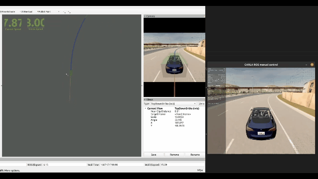

## Controller

横向控制：LQR, PurePuresuit, Stanley

纵向控制：PID


## Overview

### 视频演示

[](https://www.bilibili.com/video/BV1uW4y1D72M/?vd_source=146dad479b5c1bce6dc702c57b43829a)





### 

## Run Controller Demo

**终端1：启动carla**

```bash
cd path/to/carla/root

./CarlaUE4.sh
```

**终端2：启动控制结点**

```
source devel/setup.bash
```

Pure Pursuit

```
roslaunch controller controller_demo.launch control_method:="PurePursuit"
```

Stanley

```
roslaunch controller controller_demo.launch control_method:="Stanley"
```

LQR

```
roslaunch controller controller_demo.launch control_method:="LQR"
```


## Parameter Tuning

[controller_config.yaml:](./config/controller_config.yaml)

```yaml
#横向控制相关参数
k_pure: 0.75 # PurePursuit"增益系数
k_cte: 5.0  #Stanley"增益系数


#LQR Q R矩阵参数

Q_ed: 10.0
Q_ed_dot: 1.0
Q_ephi: 15.0
Q_ephi_dot: 1.0
R_value: 20.0


#纵向控制PID
kp: 0.5
ki: 0.05
kd: 0.05
```


## ROS TOPIC

#### Subscribed topic

- `"/carla/" + role_name + "/odometry"`  ：获取车辆当前状态
- `"/reference_line/local_waypoint"` ：获取路径规划轨迹点


#### Published topic

- `"/carla/" + role_name + "/vehicle_control_cmd"` ： 发布控制指令
- `"/trajectory"`：发布行驶轨迹


## Note for Algorithm 

[横向控制](https://github.com/czjaixuexi/Control/blob/main/note/%E6%A8%AA%E5%90%91%E6%8E%A7%E5%88%B6.md)

[纵向控制](https://github.com/czjaixuexi/Control/blob/main/note/%E7%BA%B5%E5%90%91%E6%8E%A7%E5%88%B6.md)

