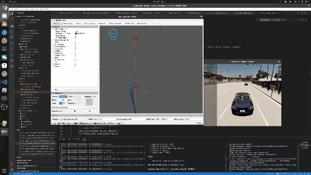
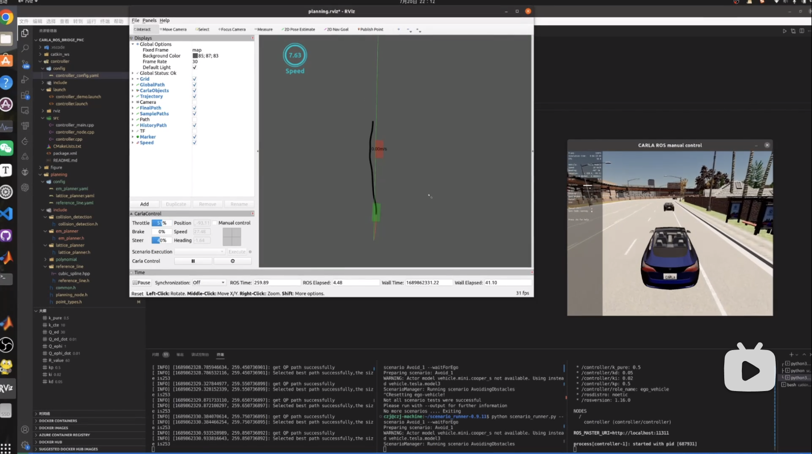

# Planning

简易场景下的路径规划

Global planner: A* (carla_ros_bridge 自带) 

ReferenceLine Provider：Cubic Spline 、FemPosDeviation（Apollo，备选）

Local planner: Lattice Planner、EM Planner（暂时只完成速度规划部分）


**TO-DO:** EM Planner速度规划部分

## Lattice Planner

### Overview

#### 视频演示

[](https://www.bilibili.com/video/BV1PX4y1s7aa/?vd_source=146dad479b5c1bce6dc702c57b43829a)


#### **Obstacle Avoidance:**




#### **Overtaking:**


#### **Following:**


### Implementation-Details

采用Spline曲线平滑参考线


#### 路径采样方式

参考：[Optimal Trajectory Generation for Dynamic Street Scenarios in a Frenet Frame](https://www.researchgate.net/publication/224156269_Optimal_Trajectory_Generation_for_Dynamic_Street_Scenarios_in_a_Frenet_Frame)

横向轨迹采样：


纵向轨迹采样：


这里分了两种工况：

跟车轨迹：起始点s、v、a和末点的v、a，用四次多项式连接

巡航轨迹：起始点s、v、a和末点的s、v、a，用五次多项式连接


#### 代价函数设计

参考了Apollo中的Lattice Planner代价函数(代码中有一定简化)

- 纵向，到达设定速度、行驶距离：

  

- 纵向，平滑： 

  

- 纵向，避免碰撞： 


- 横向，偏移： 

​		


- 横向，舒适性：


#### 轨迹验证

• 碰撞检测

• 速度阈值检测

• 加速度阈值检测

• 曲线行驶曲率检测


## EM Planner

目前暂时只完成了路径规划部分，速度规划等后面有时间再做。

### Overview

#### 视频演示

[](https://www.bilibili.com/video/BV1qV411K7cN/?vd_source=146dad479b5c1bce6dc702c57b43829a)


#### **Obstacle Avoidance:**


### Implementation-Details

TO-DO


## Run Planning Demo

**终端1：启动carla**

```bash
cd path/to/carla/root

./CarlaUE4.sh
```


**终端2：启动Planning结点**

```
source devel/setup.bash
```

Lattice Planner

```bash
roslaunch planning planning_demo.launch planning_method:="Lattice"
```

EM Planner

```bash
roslaunch planning planning_demo.launch planning_method:="EM"
```


**终端3：启动scenario runner** 

scenario_runner-0.9.11目录下

```bash
python scenario_runner.py --scenario Avoid_and_Follow_1 --waitForEgo   #用于Lattice Planner
python scenario_runner.py --scenario Avoid_1 --waitForEgo			   #用于EM Planner
```


**终端4：启动控制结点**

```bash
source devel/setup.bash

roslaunch controller controller.launch
```


## Parameter Tuning

[lattice_planner.yaml](./config/lattice_planner.yaml)

```yaml
#Lattice Planner 路径采样相关参数
sample_max_time: 4.0 # 最大采样时间
sample_min_time: 2.5  #最小采样时间
sample_time_step: 0.5 # 采样时间step
sample_lat_width: 3.75 # 采样横向距离
sample_width_length: 0.25 #采样横向距离间隔

w_object: 0.1 # 纵向目标代价
w_lon_jerk: 0.01 # 纵向舒适代价
w_lat_offset: 40.0 # 横向偏离代价
w_lat_acc: 0.01 # 横向舒适代价
```


[em_planner.yaml](./config/em_planner.yaml)

```yaml
#EM Planner 相关参数

#########路径规划相关##############
#DP Path cost
dp_sample_l: 1.0 # dp采样横向距离间隔
dp_sample_s: 5.0 # dp采样纵向距离间隔
dp_sample_rows: 5 # dp采样行数（横向）
dp_sample_cols: 5  # dp采样列数（纵向）

dp_cost_collision: 1.0e+9 
dp_cost_dl: 150.0
dp_cost_ddl: 10.0
dp_cost_dddl: 1.0
dp_cost_ref: 50.0

#QP Path cost
qp_cost_l: 15.0
qp_cost_dl: 150.0
qp_cost_ddl: 10.0
qp_cost_dddl: 1.0
qp_cost_ref: 10.0
qp_cost_end_l: 0.0
qp_cost_end_dl: 0.0
qp_cost_end_ddl: 0.0


#########速度规划相关############
#TO- DO
```


[reference_line.yaml](./config/em_planner.yaml)

```yaml
#FemPosDeviation（Apollo）平滑相关参数
ref_weight_smooth: 70  #参考线平滑代价
ref_weight_path_length: 10  #参考线轨迹长度代价
ref_weight_ref_deviation: 20 #参考线偏移代价
# 二次规划几何相似度约束
x_lower_bound : -0.1
x_upper_bound : 0.1
y_lower_bound : -0.1
y_upper_bound : 0.1

#是否使用离散点平滑
use_discrete_smooth: false
```


## ROS TOPIC

#### Subscribed topic

- `"/carla/" + role_name + "/odometry"`:获取车辆当前状态
- `"/carla/" + role_name + "/waypoints"`: 获取carla规划后的全局路径
- `"/cruise_speed"` : 获取巡航车速
- `"/carla/" + role_name + "/imu"` : 获取imu信息
- `"/carla/" + role_name + "/objects"` : 获取障碍物信息


#### Published topic

- `"/reference_line/local_waypoint"` : 发布给控制器的局部路径点信息
- `"/reference_line/ref_path"` : 参考线可视化
- `"/reference_line/sample_paths"` : 发布采样轨迹，用于rivz可视化
- `"/reference_line/final_path"`: 发布最优轨迹，用于rivz可视化
- `"/reference_line/history_paths"`: 发布历史参考路径，用于rivz可视化
- `"/speed_marker_text"`: 发布目标速度，用于rivz可视化


